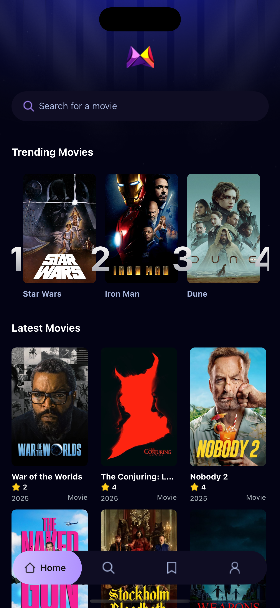

# 🎬 MovieFlix

<div align="center">
  
  
  **Modern Movie Discovery App**
  
  [](https://reactnative.dev/)
  [](https://expo.dev/)
  [](https://www.typescriptlang.org/)
  [](https://tailwindcss.com/)
</div>

A sleek, dark-themed mobile application built with React Native and Expo for discovering and exploring movies. Features an intuitive interface with powerful search capabilities and beautiful movie browsing experience.

## ✨ Key Features

<table>
<tr>
<td width="50%">

🎨 **Modern Dark UI**
- Eye-friendly dark theme
- Sleek geometric logo design
- Intuitive user interface

🔍 **Smart Search**
- Real-time movie search
- Advanced filtering options
- Search history tracking

</td>
<td width="50%">

📱 **Mobile Optimized**
- Responsive design
- Smooth animations
- Cross-platform support

🎬 **Movie Discovery**
- Latest movies showcase
- Beautiful card layouts
- Detailed movie information

</td>
</tr>
</table>

## 🛠️ Tech Stack

- **Framework**: React Native with Expo
- **Navigation**: Expo Router with tab navigation
- **Styling**: NativeWind (Tailwind CSS for React Native)
- **Language**: TypeScript
- **State Management**: Custom hooks with React hooks
- **API Integration**: Custom API service layer

## 📦 Key Dependencies

<details>
<summary>Click to expand full dependency list</summary>

### Core
- `expo` (~53.0.22) - Expo SDK
- `react` (19.0.0) - React library  
- `react-native` (0.79.6) - React Native framework
- `expo-router` (~5.1.5) - File-based routing
- `nativewind` (^4.1.23) - Tailwind CSS for React Native

### UI & Navigation
- `@react-navigation/bottom-tabs` (^7.3.10) - Bottom tab navigation
- `@react-navigation/native` (^7.1.6) - Navigation library
- `expo-vector-icons` (^14.1.0) - Icon library

### Features
- `expo-image` (~2.4.0) - Optimized image component
- `expo-haptics` (~14.1.4) - Haptic feedback
- `react-native-reanimated` (~3.17.4) - Animations
- `react-native-gesture-handler` (~2.24.0) - Gesture handling

</details>

## 🚀 Quick Start

### Prerequisites
- Node.js (v18+)
- Expo CLI
- iOS Simulator or Android Studio

### Installation

```bash
# Clone repository
git clone https://github.com/ismailcankaratas/movie_app.git
cd movie_app

# Install dependencies
npm install

# Start development server
npm start

# Run on specific platform
npm run ios     # iOS
npm run android # Android  
npm run web     # Web
```

## 📁 Project Structure

```
movie_app/
├── 📱 app/                 # App routes & screens
│   ├── (tabs)/            # Tab navigation
│   ├── movies/            # Movie details
│   └── onboarding.tsx     # Onboarding
├── 🧩 components/          # Reusable components
│   ├── MovieCard.tsx      # Movie cards
│   └── SearchBar.tsx      # Search interface
├── 🔧 services/            # API & data layer
│   ├── api.ts            # API config
│   └── useFetch.ts       # Custom hooks
├── 📋 constants/           # App constants
├── 🎨 assets/             # Static assets
└── 📝 interfaces/          # TypeScript types
```

## 🎨 UI Highlights

<div align="center">

| Feature | Description |
|---------|-------------|
| 🎭 **Dark Theme** | Modern, eye-friendly interface |
| 🔍 **Smart Search** | Real-time movie discovery |
| 📱 **Responsive Grid** | 3-column movie layout |
| 🧭 **Tab Navigation** | Intuitive bottom navigation |
| ⚡ **Loading States** | Smooth user experience |

</div>

## 🔧 Scripts

| Command | Description |
|---------|-------------|
| `npm start` | Start development server |
| `npm run ios` | Run on iOS simulator |
| `npm run android` | Run on Android device |
| `npm run web` | Run in web browser |
| `npm run lint` | Run ESLint |

## 📱 App Info

| Property | Value |
|----------|-------|
| **Bundle ID** | `com.anonymous.movie-app` |
| **App Name** | MovieFlix |
| **Version** | 1.0.0 |
| **Orientation** | Portrait |
| **Architecture** | New Architecture Enabled |

## 🚀 Deployment

```bash
# Build for platforms
expo build:ios      # iOS
expo build:android  # Android
expo build:web      # Web
```

## 🤝 Contributing

1. Fork the repository
2. Create feature branch: `git checkout -b feature/amazing-feature`
3. Commit changes: `git commit -m 'Add amazing feature'`
4. Push branch: `git push origin feature/amazing-feature`
5. Open Pull Request

## 📞 Support

<div align="center">

**Need help?** 📧 [ismailcankaratasss@gmail.com](mailto:ismailcankaratasss@gmail.com) | 🐛 [Create Issue](https://github.com/ismailcankaratas/movie_app/issues)

---

**🎬 MovieFlix** - Discover your next favorite movie! ✨

Made with ❤️ by [Ismail Can Karataş](https://github.com/ismailcankaratas)

</div>
